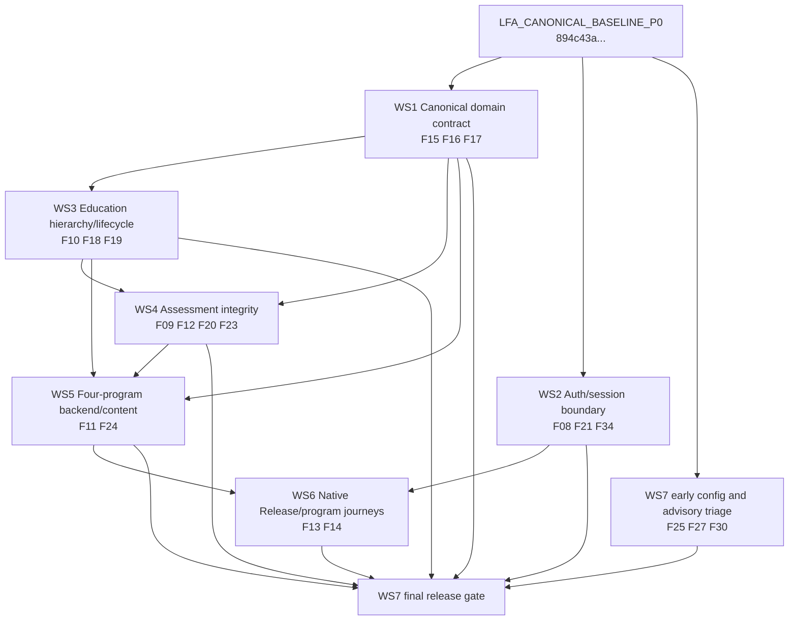

# LFA P1 Remediation Plan 2026

Plan status: **OWNER REVIEW REQUIRED — IMPLEMENTATION NOT STARTED**

Canonical input: `LFA_CANONICAL_BASELINE_P0` at `894c43a4a37af4a8a583240a5a2d0b1f31a3fdee`

Machine-readable companion: [LFA_P1_WORKSTREAMS_2026.json](LFA_P1_WORKSTREAMS_2026.json)

## 1. P1 Executive Summary

This plan covers exactly 20 open P1 findings: F08, F09, F10, F11, F12, F13, F14, F15, F16, F17, F18, F19, F20, F21, F23, F24, F25, F27, F30, and F34. It creates seven separately branchable and reviewable workstreams. No application code, database schema, data, deployment configuration, or production environment is changed by this planning task.

The sequence freezes the canonical domain before code begins to depend on it. The four program IDs, entitlement boundary, progression write authority, age/season rule, and global-credit ownership come first. The education hierarchy and content lifecycle then establish stable program/module/version identities. Assessment integrity builds on those identities. Four-program backend and approved content follow. Native navigation and assessment work start only after those backend contracts are proven. Supply-chain, container, Release, and biometric safety checks close the P1 release gate without changing the retained platform.

The plan preserves the modular monolith, FastAPI/Jinja web adapters, SQLAlchemy/PostgreSQL, Redis/Celery where already used, and the native SwiftUI/AuthManager/APIClient/Keychain foundation. `REWRITE` is limited to the old raw-SQL curriculum adapter in F10. The fabricated generic progression handlers were already closed in P0 under F07; P1 must not recreate them. All other P1 actions are bounded `CLEAN`, `REFACTOR`, or prerequisite-gated `BUILD` work.

Historical licenses, credits, progress, curriculum, and learner outcomes remain immutable during planning. Any later data work must follow `DISCOVER → MAP → REHEARSE → VALIDATE → MIGRATE`. The first four stages use an isolated checkout and disposable or sanitized-restored PostgreSQL. `MIGRATE` requires a separate owner-approved plan. Unknown legacy identities and evidence gaps remain fail-closed.

## 2. Dependency Graph

WS2 may proceed after the baseline while WS1 is being reviewed because it does not select product semantics. WS7 may perform read-only advisory and recipe discovery early, but dependency upgrades and the final container/release gate run on the settled P1 tree. WS6 cannot expose a program before WS5 proves its entitlement, content, assessment, and completion contracts.

## 3. Finding → Workstream Matrix

| Finding | Workstream | Domain | Action | Principal dependency | Blocks |
| --- | --- | --- | --- | --- | --- |
| F15 | WS1 | canonical program/license/progression | REFACTOR | legacy identity DISCOVER/MAP | WS3, WS5, WS6 |
| F16 | WS1 | age/season eligibility | REFACTOR | owner decision OD01 | onboarding/enrollment parity |
| F17 | WS1 | global credits/history | REFACTOR | P0 credit baseline; legacy mapping | F11 credit routes |
| F08 | WS2 | refresh/revocation | REFACTOR | durable session state | native auth trust |
| F21 | WS2 | invitation consumption | REFACTOR | shared registration command | one-use guarantee |
| F34 | WS2 | hybrid auth/CSRF | REFACTOR | validated auth-mode context | browser API writes |
| F10 | WS3 | curriculum adapter | REWRITE | WS1; schema/content mapping | F18, F24, native curriculum |
| F18 | WS3 | hierarchy/program/version assignment | REFACTOR | F10 active hierarchy | AL authorization/provenance |
| F19 | WS3 | content lifecycle | REFACTOR | one lifecycle model | safe content publishing |
| F09 | WS4 | adaptive API contract | REFACTOR | WS3 IDs; issued attempt | adaptive/native reliability |
| F12 | WS4 | quiz scoring | REFACTOR | immutable issued assessment | completion integrity |
| F20 | WS4 | outcome provenance/audit | REFACTOR | WS1 context; WS3 version | reconstructable outcomes |
| F23 | WS4 | adaptive submission integrity | REFACTOR | F18/F20 | score/XP integrity |
| F11 | WS5 | four-program service contracts | REFACTOR | WS1, WS3, WS4 | backend/native completion |
| F24 | WS5 | approved content coverage | BUILD | WS3, WS4; OD02/OD03 | program release claims |
| F13 | WS6 | iOS Release compilation | CLEAN | recorded build toolchain | native Release gate |
| F14 | WS6 | native program journeys | BUILD | WS2, WS5; OD03 | native parity |
| F25 | WS7 | biometric production guard | REFACTOR | existing flags/checklist | safe future activation |
| F27 | WS7 | dependency advisories | REFACTOR | reachability/deployed-version triage | release recommendation |
| F30 | WS7 | reproducible containers | REFACTOR | retained runtime topology | full regression evidence |

The JSON companion records every finding's full root cause, likely files/modules, dependencies, blocked capabilities, schema/data expectation, backward-compatibility needs, web/API/native impact, tests, rollback, and owner decision.

## 4. Canonical Architecture Decisions

1. **Program identity.** The only product identifiers are `LFA_FOOTBALL_PLAYER`, `LFA_COACH`, `GANCUJU_PLAYER`, and `INTERNSHIP`. `LFA_PLAYER_PRE/YOUTH/AMATEUR/PRO` and academy values are season or age representations, not additional entitlements. Historical `PLAYER` maps to `GANCUJU_PLAYER` only where recorded evidence confirms the audit mapping; ambiguous text is never inferred.

2. **Entitlement authority.** `UserLicense` is the user-plus-canonical-program entitlement record. Web and API call one entitlement/eligibility policy. Native consumes the resulting contract and does not reproduce business rules. Transitional aliases may exist at input/output boundaries but cannot become new write authorities.

3. **Progression authority.** A single program progression command owns each level/outcome transaction. `SpecializationProgress` holds accumulated program measures, `LicenseProgression` holds immutable level-transition history, and `UserLicense.current_level` is the entitlement-facing current-level projection. None may be updated by an independent sync path. WS1 must verify this mapping against sanitized data before freezing schema mechanics; uncertain rows remain unchanged. Track/module completion stays in the education hierarchy and cannot silently promote a license without the command.

4. **Age and season.** Eligibility is a versioned domain policy with a named effective date/cutoff. The server decides eligibility; web and native render its result and reason. Engineering will not choose between the conflicting 5–13/14–18 and 6–11/12–18 rules. OD01 must settle the boundaries and treatment of existing learners.

5. **Global credits.** `User.credit_balance` plus the immutable user-owned ledger remain the write authority established by P0. Program, license, purchase, and operation IDs are context. License wallet fields may temporarily survive as read-only compatibility projections after mapping; they cannot receive new independent writes.

6. **Education model.** The canonical structure is Program → Track/Curriculum → Module → Lesson/Component → immutable assessment/content version. Program assignment, hierarchy, version, and lifecycle are persisted and constrained. Titles, prefixes, categories, language, and descriptions remain display/search metadata and cannot authorize access.

7. **Content lifecycle.** One status controls draft, published, retired/unavailable behavior. Learner selection and direct reads use the same policy. Publishing creates or activates a versioned artifact; rollback makes a version unavailable and preserves history.

8. **Assessment/outcome integrity.** The server issues an attempt containing question membership, allowed options, program/hierarchy identity, and scoring/content version. One atomic command validates and finalizes it, then writes outcome, XP/progression effect, and audit provenance together. Request logs remain operational logs and are not learner-outcome evidence.

9. **Authentication boundary.** Refresh tokens have durable family/jti or equivalent version state, rotate once, and support logout/password-change revocation. CSRF policy follows the validated credential mode: cookie-authenticated mutations require CSRF; a valid Bearer-only request may be exempt. Header appearance and route prefix are not security authorities.

10. **Biometric boundary.** Production configuration rejects fake providers and test keys before startup. This engineering guard does not authorize biometric production use. Activation remains behind the existing legal/DPO/accuracy owner gate.

11. **Platform boundary.** No microservice split, universal repository layer, new workflow/event platform, payment provider, cloud migration, WebView education shell, or SwiftUI foundation replacement is planned.

## 5. DB/Data Migration Risks

| Area | Schema change expected | Data migration expected | Principal risk | Required control |
| --- | --- | --- | --- | --- |
| Refresh/revocation F08 | Yes: minimal family/jti/version/revocation state and indexes | Cutover only; no token-history backfill | pre-cutover refresh validity and concurrent rotation | one-winner PostgreSQL test; explicit cutover/version behavior |
| Invitation F21 | Conditional constraint/index | No historical correction | two consumers win check-then-write | row-lock or conditional-update race test |
| Program/license/progress F15 | Likely additive identity/constraints/projections | Yes later | wrong `PLAYER` mapping, orphaned/dual authority | value/count/orphan inventory; owner-approved mapping; rehearsal |
| Age/season F16 | Conditional policy revision/effective fields | Conditional later | reclassifying existing learners | OD01; boundary fixtures; no bulk update in WS1 |
| Global credits F17 | Likely projection/context/constraint cleanup | Yes later | balance/ledger drift or history loss | P0 invariants; immutable ledger; OD04 for ambiguity |
| Curriculum F10/F18 | Yes or conditional: active hierarchy/program/version FKs | Yes later | hierarchy semantic mismatch | preserve old tables/content; mapping and reversible rehearsal |
| Content lifecycle F19 | Expected single status/version constraint | Yes later | draft accidentally published | unknown flag combinations become unavailable |
| Assessment F12/F20/F23 | Yes: issued attempt, membership, uniqueness, outcome revision/provenance | Structural known references only | fabricated historical evidence or duplicate XP | no historical score recomputation; atomic transaction tests |
| Four-program content F24 | Uses prior schema | Approved versioned import later | legacy seeds treated as approved truth | owner/subject manifest; draft import rehearsal |
| F09/F13/F25/F27/F30/F34 | No direct schema expected | None expected | hidden dependency behavior | reclassify before merge if schema/DDL changes emerge |

Every future migration has five explicit gates:

1. **DISCOVER:** inspect the active migration head and sanitized/restored PostgreSQL values, counts, duplicates, nulls, orphans, constraints, and references. No writes.
2. **MAP:** produce a deterministic old→canonical mapping with an `AMBIGUOUS/UNMAPPED` state. Owner decisions apply only to product/history meaning.
3. **REHEARSE:** run upgrade and rollback or forward-repair on a disposable clone; capture row counts, invariants, locks, duration, and application compatibility.
4. **VALIDATE:** run API/web/native contracts, authorization, replay, rollback, and concurrency gates against the rehearsed schema. Ambiguous rows must fail closed.
5. **MIGRATE:** create a separately approved execution plan. This P1 planning task does not authorize this stage, production access, a backfill, or data correction.

Financial, entitlement, learner-outcome, and content-version history must never be deleted to make constraints pass. If a downgrade cannot preserve new immutable evidence, the rollback is an application rollback plus forward schema repair, documented before merge.

## 6. API/Web/Native Impact

| Contract area | API | Web | Native | Compatibility rule |
| --- | --- | --- | --- | --- |
| Program/entitlement | four product IDs; explicit season/eligibility result | shared server policy for select/onboarding | renders server decision | boundary aliases are explicit and temporary |
| Credits | account-wide balance/history with program context | global wallet UI remains | existing global Credits UI remains | no license-owned writes; retain P0 idempotency |
| Refresh/logout | rotation/revocation error contract | effective logout/password invalidation | AuthManager handles forced re-auth | preserve response fields or version transition |
| Registration | deterministic invitation conflict | same atomic command | handles conflict DTO | one transaction, one winner |
| CSRF | validated Bearer remains supported | cookie mutations send CSRF | Bearer flow unaffected | auth mode, not `/api/v1` prefix, selects policy |
| Curriculum | active hierarchy and stable IDs | no prefix-based authority | typed hierarchy after freeze | semantic route changes require OpenAPI/version review |
| Content lifecycle | published version only | one admin lifecycle | unavailable/draft hidden | old flags read only during transition |
| Assessment | issued attempt and idempotent finalize | opaque attempt/presentation ID | runner uses same DTO | never accept client-authored question/option membership |
| Outcome history | actor/context/before-after/version | no second commit | read-only outcome/version identity | old gaps stay explicit; no fabricated backfill |
| Four programs | real service contracts/readiness | truthful program availability | only backend-ready destinations | do not advertise incomplete paths |

Each workstream that changes an HTTP contract must diff the current OpenAPI snapshot, classify additive versus breaking changes, and validate real Pydantic serialization. Native consumer fixtures must use captured server responses rather than handwritten mocks. Breaking changes need a staged compatibility adapter or explicit API version; silent meaning changes are forbidden.

## 7. Workstream 1…N detailed

### Workstream 1 — Canonical domain contract and legacy mapping

**Branch:** `codex/p1-ws1-canonical-domain-contract`

**Findings:** F15, F16, F17

**Prerequisites:** baseline tag; read-only sanitized schema/data discovery; OD01 before final age policy.

**Target:** one four-program entitlement/eligibility/progression contract and one global credit authority, with an evidence-backed legacy map.

**Subsystems:** specialization configs/model/services, `UserLicense`, `SpecializationProgress`, `LicenseProgression`, credit models/services, web onboarding/select.

**Explicit exclusions:** historical backfill, commercial reinterpretation, curriculum/content BUILD, native screen work.

| Finding | Root cause and likely files | Change / DB and data | Compatibility and surface impact | Tests / rollback / owner |
| --- | --- | --- | --- | --- |
| F15 | Product, season, license, and progress identities evolved independently. `config/specializations`, `app/models/specialization.py`, `app/models/license.py`, `app/services/specialization*`, onboarding/select routes. | **REFACTOR.** Additive canonical identity/constraints or mapping table likely. Historical mapping later only. | Explicit input aliases; web/API share four-ID policy; native IDs remain stable. Blocks WS3/WS5/WS6. | Four-ID allowlist, alias/ambiguity fail-closed, policy parity, progression transaction, migration rehearsal. Revert adapters/additions; never rewrite old IDs in place. OD04 only for ambiguous history. |
| F16 | Duplicated age bands/current-age/cutoff disagree. `age_requirements.py`, session-based player service, validation, configs. | **REFACTOR.** Versioned policy; optional persisted revision/cutoff. Existing-learner migration conditional and later. | API returns decision/reason/revision; web/native render it. | Boundary birthdays, June-30/July-1, timezone determinism, three-surface fixtures. Roll back policy version, preserve decisions. **OD01 required.** |
| F17 | Global user balance coexists with license wallets and XOR ledger ownership. User/license/credit models, credit service and player credit routes. | **REFACTOR.** User ledger/balance stays authority; additive context/projection changes expected. Historical reconciliation later. | Account-wide history for web/API/native; legacy fields read-only if needed. Blocks F11 credit adapters. | Ledger/balance invariant, cross-program context, P0 replay/rollback/concurrency, cascade retention. Revert projections only; never ledger. OD04 for ambiguous rows. |

**Exit criteria:** exactly four entitlement IDs; owner-approved age/cutoff boundary tests; one progression command and explicit projections; zero independent license-wallet writes; web/API policy parity; mapping report with value/count/orphan/ambiguity evidence; all P0 credit gates green.

**Mandatory gate:** canonical-ID and age matrix, authorization/policy parity, P0 credit replay/concurrency/rollback, and any proposed migration rehearsal on disposable PostgreSQL.

### Workstream 2 — Authentication lifecycle, invitation atomicity, and hybrid CSRF

**Branch:** `codex/p1-ws2-auth-session-boundary`

**Findings:** F08, F21, F34

**Prerequisites:** baseline; current cookie/Bearer route inventory.

**Target:** single-use refresh and effective revocation, atomic invitation consumption, and CSRF tied to validated auth mode.

**Subsystems:** core/API/web auth, auth dependencies, invitation model, CSRF middleware, native AuthManager/APIClient.

**Explicit exclusions:** identity-provider replacement, broad middleware rewrite, payment provider, native UI redesign. Secure account recovery may be separately planned; F08 does not silently expand into an unapproved recovery feature.

| Finding | Root cause and likely files | Change / DB and data | Compatibility and surface impact | Tests / rollback / owner |
| --- | --- | --- | --- | --- |
| F08 | Signed JWT lacks durable jti/family/version state; refresh/logout/password change do not consume/revoke. `app/core/auth.py`, API/web auth, models, native Auth/Networking. | **REFACTOR.** Minimal revocation schema/indexes expected. Cutover invalidates or versions old refreshes; no backfill. | Preserve token payload fields where safe; explicit replay/revoked errors; native keeps single-flight behavior. | Old-token replay, two concurrent refreshes one winner, logout and password-change invalidation, expiry cleanup, native fixture. Preserve revocation rows on rollback. No owner decision. |
| F21 | API/web invitation flow is unlocked check-then-write. API/web auth and `InvitationCode`. | **REFACTOR.** Shared registration transaction; conditional schema only if required. No historical correction. | Same request/response where possible; deterministic used/conflict result across clients. | Concurrent different emails one winner, bonus once, transaction rollback, restricted/expired cases. Never reset consumed code automatically. No owner decision. |
| F34 | Route prefix and Bearer-looking syntax bypass CSRF before credential validation. CSRF middleware/core, dependencies, hybrid endpoints. | **REFACTOR.** No DB/data work. | Cookie writes require CSRF; verified Bearer-only clients remain compatible, including native. | Cookie missing/invalid/valid CSRF, valid Bearer, fake Bearer cannot bypass, same-site cases, dependency parity. Never restore blanket exemption. No owner decision. |

**Exit criteria:** replay/revocation and invitation races pass on PostgreSQL; cookie/Bearer CSRF matrix passes; API/web call the same registration/auth context; P0 password and sensitive-header logging protections remain green.

**Mandatory gate:** auth units and integration, concurrency, OpenAPI error contract, native auth fixtures, security logging suite, and P0 authorization regression.

### Workstream 3 — Canonical education hierarchy and content lifecycle

**Branch:** `codex/p1-ws3-education-hierarchy-lifecycle`

**Findings:** F10, F18, F19

**Prerequisites:** WS1 contract; active/legacy curriculum DISCOVER and MAP.

**Target:** active-schema curriculum routes, persisted program/module/version identity, and one fail-closed lifecycle.

**Subsystems:** curriculum endpoints, Track/Module/Component ORM, quiz/adaptive models, import service, candidate selection, web module selection.

**Explicit exclusions:** education-platform rewrite, legacy table deletion, content duplication, subject-matter approval.

| Finding | Root cause and likely files | Change / DB and data | Compatibility and surface impact | Tests / rollback / owner |
| --- | --- | --- | --- | --- |
| F10 | Mounted raw SQL encodes absent legacy tables and incompatible hierarchy. Curriculum track/module endpoints and active models/migrations. | **REWRITE**, limited to this adapter. Active hierarchy preferred; additive mapping keys conditional. Historical migration later only. | Preserve route shapes only when semantics remain truthful; version otherwise. Stable IDs for web/native. | Active-schema integration, mapping/ambiguity failure, migration rehearsal, OpenAPI diff. Revert adapter/additions; preserve old rows/content. OD03/OD04 for meaning/ambiguity. |
| F18 | Program/module/version lives in optional metadata and title prefixes, not constrained fields. AL import, quiz model, adaptive web/service. | **REFACTOR.** Canonical program/hierarchy/version FKs expected; mapped import later. | Legacy metadata can be displayed but never authorizes; version import and consumer contracts. | FK constraints, cross-program BOLA, import mapping, ambiguous quarantine, persisted-scope selection. OD03 approves content meaning. |
| F19 | Import writes `is_active`; selection reads default-`PUBLISHED` `content_status`. Import/model/selection. | **REFACTOR.** One authoritative lifecycle/status/version constraint expected; existing combinations mapped later, unknown→unavailable. | Admin/web/API/native see one lifecycle; bounded compatibility read for old flag. | Draft selection/direct read denial, publish transition, concurrent publish, rollback-to-draft, legacy mapping. No owner decision. |

**Exit criteria:** mounted routes use the active ORM; hierarchy/ownership/version/lifecycle are durable; title/description no longer acts as authority; drafts are unreachable; the historical workflow reaches VALIDATE before any MIGRATE request.

**Mandatory gate:** Alembic upgrade/schema assertions, route/OpenAPI contract, BOLA, direct-fetch and selection denial, import rollback, and disposable PostgreSQL rehearsal.

### Workstream 4 — Assessment integrity and outcome evidence

**Branch:** `codex/p1-ws4-assessment-integrity`

**Findings:** F09, F12, F20, F23

**Prerequisites:** WS1 progression context; WS3 hierarchy/lifecycle/version.

**Target:** real handler/service agreement, complete scoring, server-issued attempts, exactly-once outcome effects, and atomic provenance.

**Subsystems:** adaptive API/web/service, quiz schema/model/service, AL sessions/logs, XP/progression dispatch, audit service/middleware, attendance outcome history.

**Explicit exclusions:** general event platform, broad audit rewrite, invented regulatory requirements, content authoring.

| Finding | Root cause and likely files | Change / DB and data | Compatibility and surface impact | Tests / rollback / owner |
| --- | --- | --- | --- | --- |
| F09 | Endpoint imports/result fields drifted from real service; mocks hide both branches. Adaptive endpoint/service/schema/tests. | **REFACTOR.** Direct contract fix needs no schema; F20/F23 carry provenance schema. No data rewrite. | One response schema for API/web/native; preserve fields or version transition. | Real service-handler tests for answer types, OpenAPI validation, no post-commit response error, native decode. Revert mapping; retain outcomes. No owner decision. |
| F12 | Denominator uses submitted valid answers; duplicates/replay/XP lack integrity boundary. Quiz service/schema/model/gamification. | **REFACTOR.** Issued attempt/membership/idempotency schema expected. Historical scores are not recomputed. | Staged attempt ID contract; explicit scoring-semantic release note. | 1/10 regression, duplicate/omitted answers, replay/concurrent finalize, XP once, rollback. Disable unsafe submission rather than revert scoring. OD03 only for thresholds. |
| F20 | Operational request logs substitute for domain evidence; AL audit is a swallowed second commit; API attendance lacks equivalent history. Audit/adaptive/quiz/import/attendance modules. | **REFACTOR.** Minimal immutable attempt/outcome revision plus actor/context/version fields expected. No fabricated backfill. | Old logs remain; web/API share outcome transaction; native reads evidence IDs only. | before/after/actor/version, atomic rollback, no caller commit, web/API parity, immutability. Preserve evidence on rollback. OD05 for retention/standard only. |
| F23 | Client defines presented options; no issued presentation membership or one-answer rule. Adaptive web/service/model/schema. | **REFACTOR.** Presentation membership and unique answer/idempotency keys expected. No historical snapshot backfill. | Opaque server-issued presentation ID for web/API/native. | unissued/foreign question and option tamper denial, repeated answer idempotency, concurrent finalize, XP once. Never restore unbound scoring. No owner decision. |

**Exit criteria:** real contracts pass; a submission belongs to one open issued attempt/version; omitted/duplicate behavior is deterministic; outcome/XP/progression/audit commit or roll back together; attendance web/API outcome history follows the same command rule.

**Mandatory gate:** real adapter contracts, tamper/replay/concurrency/rollback, immutable-history assertions, OpenAPI diff, native fixtures, and PostgreSQL exactly-once evidence.

### Workstream 5 — Four-program backend completion and approved content

**Branch:** `codex/p1-ws5-four-program-backend-content`

**Findings:** F11, F24

**Prerequisites:** WS1, WS3, WS4; OD02/OD03 for completion/content claims.

**Target:** zero missing service calls and approved versioned content/assessment coverage for each released program.

**Subsystems:** Coach/GANCUJU/Internship/Football compatibility endpoints and services, content corpus, program configs.

**Explicit exclusions:** separate wallets, Football-content cloning, claims of exams/qualification without approval, execution of legacy seed scripts against production.

| Finding | Root cause and likely files | Change / DB and data | Compatibility and surface impact | Tests / rollback / owner |
| --- | --- | --- | --- | --- |
| F11 | Twenty-four mounted call sites refer to methods removed or never implemented and encode stale authorities. Program endpoint folders and specialization services. | **REFACTOR.** Delegate to WS1/WS4 commands; additive schema only when those authorities require it. Legacy mapping later. | Truthful route compatibility/deprecation; shared services for web/API; native uses stabilized endpoints only. | zero runtime missing-method inventory, all 24 real service-handler paths, authorization, replay/rollback, four-program DB journeys. Revert adapters by program; do not restore fake success. OD02 for progression meaning only. |
| F24 | All 31 validated JSON/375 questions cover Football Player; other content is legacy/unapproved. Content directory, configs, legacy seed scripts. | **BUILD** after approval. Uses WS3/WS4 schema; approved versioned import later, never legacy seeds as migration. | Existing Football versions remain; program availability is truthful across web/API/native. | validator, subject-approval manifest, mapping, lifecycle, assessment/completion coverage, four-program journey. Roll back by making new version unavailable. **OD02/OD03 required.** |

**Exit criteria:** all 24 call sites resolve to real commands; no program owns a wallet; each released program has approved hierarchy/content/assessment/completion evidence; incomplete programs fail closed; four-program API/PostgreSQL gates pass.

**Mandatory gate:** per-call-site real adapter tests, authorization and entitlement matrix, credit/progression replay/rollback, content validator/import, assessment/completion, OpenAPI and consumer fixtures.

### Workstream 6 — Native Release stability and four-program journeys

**Branch:** `codex/p1-ws6-native-release-programs`

**Findings:** F13, F14

**Prerequisites:** WS2 auth contract; WS5 backend/content readiness; OD03 release scope.

**Target:** green Debug/Release builds and real native destinations/education flows for approved ready programs.

**Subsystems:** GoPro diagnostics, Xcode config, AuthManager/APIClient, hub/tab navigation, Education views/models.

**Explicit exclusions:** WebView-first redesign, replacement of native auth/network/keychain, Vision/camera rewrite, enabling programs ahead of backend truth.

| Finding | Root cause and likely files | Change / DB and data | Compatibility and surface impact | Tests / rollback / owner |
| --- | --- | --- | --- | --- |
| F13 | Release references DEBUG-only diagnostics/types. GoPro debug view/probe and project config. | **CLEAN.** No DB/data. | Debug diagnostics and current no-MPC design survive; Release excludes symbols. | Unsigned Debug/Release, debug smoke, Release symbol/config inspection. Revert guard cleanup if Debug regresses. No owner decision. |
| F14 | Three cards have nil actions; EducationView is not a runner. Hub/tab/Education/Models/Networking. | **BUILD.** No direct DB/data; consumes earlier contracts. | Preserve Football and native foundation; add only ready programs and typed lesson/assessment flows. | availability/navigation, entitlement denial, curriculum/runner, error/offline/accessibility, fixtures, both builds. Roll back program availability/navigation only. **OD03 required.** |

**Exit criteria:** Debug and Release pass; diagnostics cannot leak into Release; owner-approved programs have real destinations; auth/curriculum/assessment/error DTOs match server; unavailable programs remain truthful.

**Mandatory gate:** native unit tests, both configurations, auth revocation fixtures, navigation and runner flows, error/offline/accessibility smoke, API fixture decoding.

### Workstream 7 — Security configuration, supply chain, and reproducible deployment

**Branch:** `codex/p1-ws7-release-security-supply-chain`

**Findings:** F25, F27, F30

**Prerequisites:** baseline scans/inventory; final gate waits for WS1–WS6 settled tree.

**Target:** unsafe biometric config rejected, advisories dispositioned/minimally remediated, and tracked container recipes boot the retained stack.

**Subsystems:** Settings/biometrics, Python/Cypress manifests, Docker/Compose, readiness, worker/scheduler.

**Explicit exclusions:** biometric activation/provider replacement, cloud migration, Streamlit resurrection, unrelated package modernization.

| Finding | Root cause and likely files | Change / DB and data | Compatibility and surface impact | Tests / rollback / owner |
| --- | --- | --- | --- | --- |
| F25 | Production Settings do not reject fake provider or test key. `app/config.py`, biometric embedding/encryption, activation checklist. | **REFACTOR.** No DB/data/re-embedding. | Test/dev fake remains explicit; production fails before serving; native/web remain gated. | production fake/test-key rejection, feature-off startup, explicit test allowance, encryption/liveness regression. Keep guard; disable feature on rollback. OD06 only for activation. |
| F27 | Declared/locked packages match advisories; reachability/deployed versions and clean resolution are unknown. Python/Cypress manifests and scans. | **REFACTOR.** No schema/data expected; reclassify if ORM DDL changes. | Minimal compatible upgrades; test Jinja/multipart/JWT/API/native-facing behavior. | audit delta, clean install, `pip check`, auth/upload/templates, full regression, OpenAPI. Revert manifests together; unresolved exploitable item remains blocker. No owner decision. |
| F30 | Compose/Dockerfile references missing files/targets and decommissioned Streamlit. Docker/compose and app/worker boot. | **REFACTOR.** No direct schema/data; migrations run only on disposable DB. | Retain FastAPI/PostgreSQL/Redis/Celery commands and documented env contracts. | tracked-file builds, fresh migration, API/readiness, Redis/worker/scheduler, restart/shutdown, test suite. Revert recipes; never deploy unproven image. No owner decision. |

**Exit criteria:** production cannot start with fake biometric identity settings; every advisory has reachability/version/remediation/blocker evidence; minimal upgrades pass full gates; application and test containers build from tracked files and prove service readiness; no deployment occurs.

**Mandatory gate:** production-settings negatives, biometric crypto/sanitization regression, security scans and clean installs, full Python/web suite, disposable container boot/migration/readiness/worker tests, final iOS Debug/Release.

## 8. Test Strategy

Every implementation workstream begins with a failing reproducer for each assigned finding. A fix is accepted only after the reproducer passes and the workstream's broader gate remains green. Tests that replace the real service with a contract-divergent mock do not count as evidence.

The layered gate is:

1. **Static and contract:** formatting/type/import checks used by the repository; runtime route/missing-method inspection; OpenAPI diff; schema constraints; native fixture decoding.
2. **Unit:** canonical policies, boundary dates, scoring, lifecycle, token state, configuration rejection. Existing proven components remain covered without rewriting their tests.
3. **Real adapter/component:** actual endpoint plus actual service plus actual response model. This is mandatory for F09 and all 24 F11 call sites.
4. **Authorization/security:** role/object/program ownership, hybrid cookie/Bearer CSRF, refresh replay/revocation, P0 password and sensitive-header redaction.
5. **Disposable PostgreSQL:** real migrations, uniqueness/FK behavior, transaction rollback, replay, and races. Concurrency tests use separate sessions/connections and barriers so both operations reach the contested boundary.
6. **Historical rehearsal:** sanitized restore only; before/after counts, mappings, ambiguous/orphan rows, invariants, upgrade timing/locks, rollback or forward repair. No production or uncontrolled fixture DB.
7. **Four-program journey:** entitlement → hierarchy → content → issued assessment → outcome/progression for each ready program, including denial and unavailable states.
8. **Web/API/native contract:** generated OpenAPI snapshot, representative real JSON fixtures, native decoding, Debug and Release builds, program navigation and error/offline behavior.
9. **Supply chain/runtime:** clean dependency install, `pip check`, pip/npm audit delta, application/test container build, fresh DB boot, health/readiness, worker/scheduler smoke.
10. **Full regression:** the widest safely runnable repository suite, P0 gate, `git diff --check`, secret/log leakage scan, and diff/scope audit against the workstream base.

Required concurrency evidence includes start barrier, independent transactions, observed winner/loser results, final row/ledger state, and invariant assertions for refresh rotation, invitation consumption, assessment finalization/XP, publish/version changes, and any progression command. SQLite or single-session mocks cannot close these cases.

Fail, skip, and not-runnable items are listed separately in each checkpoint with cause and release effect. A high pass count cannot override a failed real adapter, Release build, security invariant, or migration rehearsal.

## 9. Rollback Strategy

Each workstream is based directly on `LFA_CANONICAL_BASELINE_P0` or the explicitly accepted predecessor workstream and is merged only after its own gate. Keep commits separable by policy/schema, adapters, consumers, and evidence so a regression can be isolated without reverting unrelated security fixes.

Application rollback must remain compatible with any durable records already created. Refresh revocations, credit ledger entries, invitation use, issued attempts, outcomes, progression history, content versions, and audit provenance are not deleted or reactivated. If old application code cannot read an additive schema safely, use a reviewed compatibility window or forward fix; do not use destructive downgrade as the default.

Migration plans must state whether downgrade is lossless. If it is not, the accepted rollback is application rollback plus forward schema repair. Content rollback changes lifecycle availability and retains versions. Native rollback disables a program destination and preserves backend state. Dependency/lockfile changes roll back as a coherent set. Container changes are never promoted until the disposable boot gate passes. Biometric rollback means feature disabled; it never means fake production results.

Any failed owner mapping leaves affected legacy rows untouched and unavailable to the new write path. No repair job, backfill, or balance/progression recomputation is authorized by this plan.

## 10. Owner Decisions

### Product/owner decisions required

| ID | Decision | Blocks | Does not block |
| --- | --- | --- | --- |
| OD01 | Exact PRE/YOUTH boundaries, July-1 cutoff behavior, and treatment of affected existing learners | F16 final policy and migration design | discovery and test harness preparation |
| OD02 | Relationship of Internship's three levels to five semesters; approved progression/completion meaning for all programs | F11 completion semantics, F24 acceptance | repair of objectively missing service contracts |
| OD03 | Per-program curriculum, assessment, localization, completion/certificate criteria and whether releases may be staged | F24 BUILD and F14 release acceptance | hierarchy/security/integrity implementation |
| OD04 | Treatment of ambiguous historical entitlement/license/purchase rows | MIGRATE stage for F15/F17 | canonical new-write model and mapping discovery |
| OD05 | Learner-outcome data purpose, retention/access rules, and applicable qualification/regulatory standard | final F20 retention/completeness acceptance | atomic provenance and no-fabrication rules |
| OD06 | Whether biometrics remain disabled R&D or target production; legal/DPO/accuracy owner | activation | F25 fail-closed production guard |

### Technical decisions already resolved by evidence

- Four canonical product IDs and global user credit ownership do not require another owner decision.
- Missing service methods, broken adaptive contracts, incomplete quiz denominator, unbound submissions, invitation race, Release compile failure, draft leakage, vulnerable dependency matches, broken container references, hybrid CSRF contradiction, and unsafe biometric configuration validation are technical remediation items.
- Entitlement uses `UserLicense`; one program progression command owns atomic writes and explicit projections/history; web/API share canonical policies; native consumes those contracts.
- Historical uncertainty is not resolved by labels, comments, old seed scripts, or inferred purchase intent.
- The absence of a documented regulatory standard must remain documented as unknown; engineering will not invent one.

## 11. Recommended execution order

1. **WS1 — Canonical domain contract and legacy mapping:** F15, F16, F17. This prevents later hierarchy, service, and native work from binding to the wrong program, progression, or wallet authority. F16's final policy waits for OD01; discovery and mapping can proceed before that decision.
2. **WS2 — Authentication/session boundary:** F08, F21, F34. It can run independently after baseline review and must settle native refresh/logout behavior before WS6.
3. **WS3 — Education hierarchy/lifecycle:** F10, F18, F19. It starts only after WS1 freezes canonical program identity. Hierarchy and lifecycle precede content creation.
4. **WS4 — Assessment integrity:** F09, F12, F20, F23. It depends on stable hierarchy/version IDs and progression context.
5. **WS5 — Four-program backend/content:** F11, F24. Broken service contracts are repaired against the canonical authorities; approved content follows hierarchy and assessment integrity. OD02/OD03 control completion claims and content BUILD.
6. **WS6 — Native Release/program journeys:** F13, F14. The F13 compile cleanup is bounded, but the branch is accepted only with the final auth/backend contracts and program readiness evidence.
7. **WS7 — Security configuration, supply chain, deployment evidence:** F25, F27, F30. Read-only triage may begin earlier. Upgrades, recipes, and final release evidence run last on the integrated tree.

For long-term hygiene, each workstream uses `codex/p1-wsN-<domain>` from the accepted predecessor SHA. Later implementation must version the owner decision record, legacy mapping, migration rehearsal, OpenAPI/native snapshots, concurrency/security evidence, and updated finding/control ledger in the repository. This planning task creates only the two requested audit/control artifacts and does not create a P1 implementation branch.

# LFA P1 PLAN COMPLETE

- **P1 finding count:** 20
- **Workstream count:** 7
- **Recommended order:** WS1 → WS2 → WS3 → WS4 → WS5 → WS6 → WS7
- **First workstream:** WS1 — Canonical domain contract and legacy mapping (F15, F16, F17)
- **Owner-decision blockers:** OD01 for final age/season policy; OD02/OD03 for progression/content/completion and release acceptance; OD04 before ambiguous historical migration; OD05 for audit-retention completeness; OD06 before biometric activation
- **DB migration expected:** Yes, additive/constraint work is expected for session revocation, canonical identities, hierarchy/lifecycle, and assessment provenance; exact migrations require DISCOVER/MAP evidence
- **Data migration expected:** Conditional and later; historical program/license/credit/content mappings and approved content imports may be required, but no backfill or data mutation is authorized now
- **Baseline SHA:** `894c43a4a37af4a8a583240a5a2d0b1f31a3fdee`
- **Report paths:** `docs/audit/LFA_P1_REMEDIATION_PLAN_2026.md`; `docs/audit/LFA_P1_WORKSTREAMS_2026.json`

IMPLEMENTATION NOT STARTED — AWAITING OWNER REVIEW
